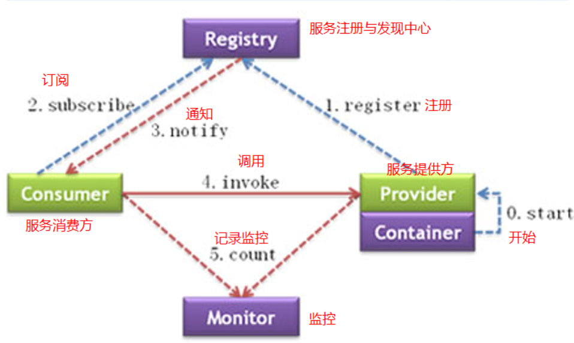

# Dubbo&Zookeeper配置方式

### 添加maven依赖

```
	<!-- https://mvnrepository.com/artifact/com.alibaba/dubbo -->
	<!-- dubbo -->
			<dependency>
    			<groupId>com.alibaba</groupId>
    			<artifactId>dubbo</artifactId>
    			<version>2.6.8</version>
			</dependency>
	<!-- https://mvnrepository.com/artifact/org.apache.zookeeper/zookeeper -->
	<!-- zookeeper分布式协调服务 -->
			<dependency>
   				<groupId>org.apache.zookeeper</groupId>
    			<artifactId>zookeeper</artifactId>
    			<version>3.6.1</version>
			</dependency>
	<!-- https://mvnrepository.com/artifact/com.github.sgroschupf/zkclient -->		
	<!-- zkclient(zookeeper客户端) -->
            <dependency>
                <groupId>com.github.sgroschupf</groupId>
                <artifactId>zkclient</artifactId>
                <version>0.1</version>
            </dependency>
```


### Kill Spring的组件扫描

```
	<!-- 开启组件扫描 -->
    <context:component-scan
            base-package="xxx.xxx.controller"/>
```


### 配置服务提供者（Service）

```
	<!-- ############## 配置dubbo服务提供者 ############## -->
    <!-- 配置当前服务的名称 -->
    <dubbo:application name="配置当前服务的名称"/>
    <!-- 配置zookeeper作为注册中心，注册服务地址 -->
    <dubbo:registry protocol="zookeeper" address="xxx.xxx.xxx.xxx:2181"/>
    <!-- 用dubbo协议在20880端口暴露服务 -->
    <dubbo:protocol name="dubbo" port="20880"/>
    <!-- 配置采用包扫描来暴露服务 -->
    <dubbo:annotation package="xxx.xxx.service.impl"/>
```


### 配置服务消费者（Controller）

```
	<!-- ############## 配置dubbo服务消费者 ############## -->
    <!-- 配置当前服务的名称 -->
    <dubbo:application name="配置当前服务的名称"/>
    <!-- 配置zookeeper作为注册中心，注册服务地址 -->
    <dubbo:registry protocol="zookeeper" address="xxx.xxx.xxx.xxx:2181"/>
    <!-- 配置采用包扫描来引用服务，产生服务接口的代理对象 -->
    <dubbo:annotation package="xxx.xxx.controller"/>
```


### 注入Controller

```
	@Reference(timeout = 10000)
    private XXXXXXService XXXXXXService;
```

**注意：@Reference的import location为com.alibaba.dubbo.config.annotation.Reference**


### 注入Service

```
	@Service(interfaceName="xxx.xxx.xxxService")
```

在类中注入@Service注解

**注意：@Service的import location为com.alibaba.dubbo.config.annotation.Service**


### 配置事务注解

由于dubbo用@service注解暴露服务，业务层需要加事务会产生代理对象，需设置proxy-target-class为true采用cglib产生代理。

```
	<tx:annotation-driven proxy-target-class="true"/>
```


### 原理图

