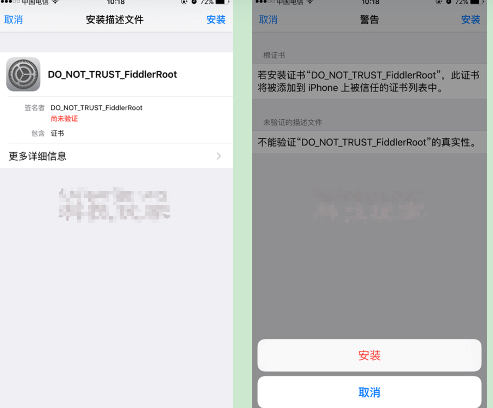

# 教你用Fiddler抓包（安卓/IOS）

Fiddler 是一个PC端的抓包工具，里面的功能很多很强大，个人平时基本都是使用它来抓包的。下面就根据本人使用经验分享一下抓包的方法。

## 配置Fiddler

1. 打开 Fidder，点击菜单栏中的 【工具】 –> 【选项]】

2. 点击 【连接】 ，设置代理端口是 8888， 勾选 【在启动时作为系统代理】【允许远程计算机连接】， 点击 OK


【注意】：如果打开浏览器碰到类似下面的报错，请打开 Fiddler 的证书解密模式（Fiddler 设置解密 HTTPS 的网络数据）

```
No root certificate was found. Have you enabled HTTPS traffic decryption in Fiddler yet?
```

点击【HTTPS】，勾选【解密HTTPS通信】【忽略服务器证书错误】，动作点里最好也点一下【信任证书】


3. 这时在 Fiddler 可以看到自己本机无线网卡的 IP 了（要是没有的话，重启 Fiddler，或者可以在 cmd 中 ipconfig 找到自己的网卡 IP）


## 配置苹果

1. 在手机端连接路由器的wifi，并且设置PC的 IP地址 与 端口


2. 访问网页输入代理 IP 和端口（比如：http://你电脑的IP:8888），下载 Fiddler 的证书，点击下图 FiddlerRoot certificate





3. 安装完了证书，可以用手机访问应用，就可以看到截取到的数据包了。


## 配置安卓

1. 长按当前wifi，选择【修改网络】

2. 将代理设置为【手动】，输入代理服务器主机名即电脑的IP，代理服务器端口就是Fiddler设置的端口即8888，点击保存.

3. 打开浏览器，访问 ：https://你电脑的IP:8888，安装一下证书就可以啦。

## Fiddler中文版本下载链接

https://if404.lanzoui.com/iwr65ttnari
