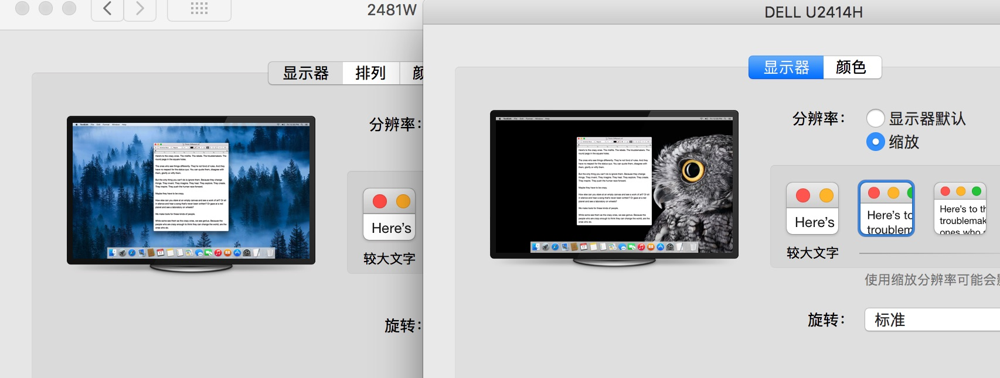
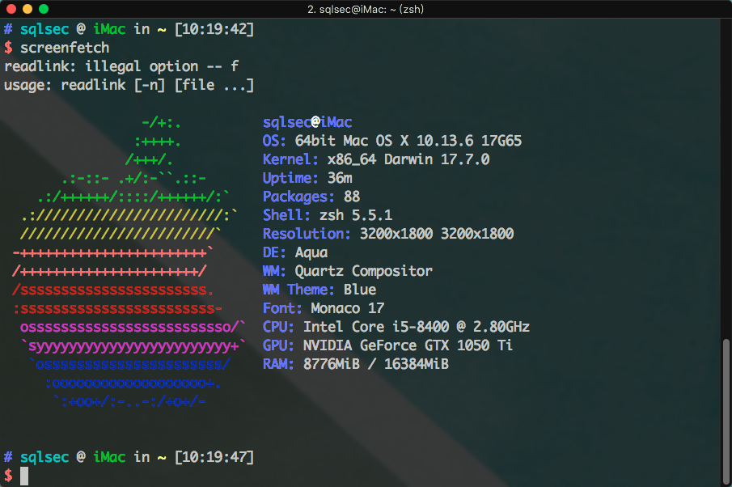
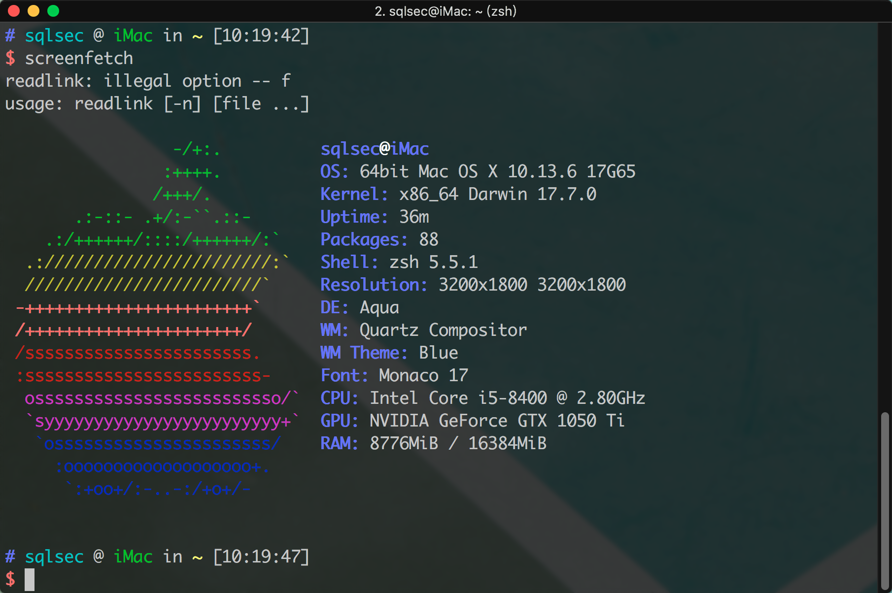
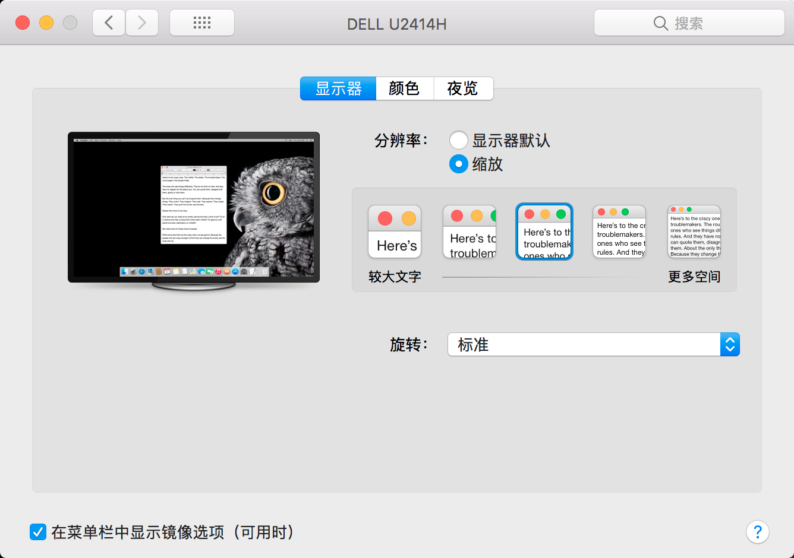
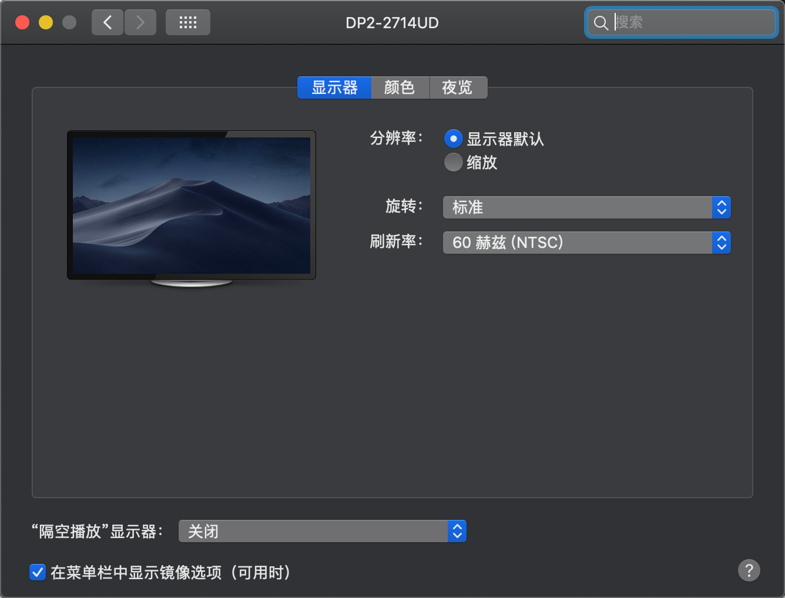
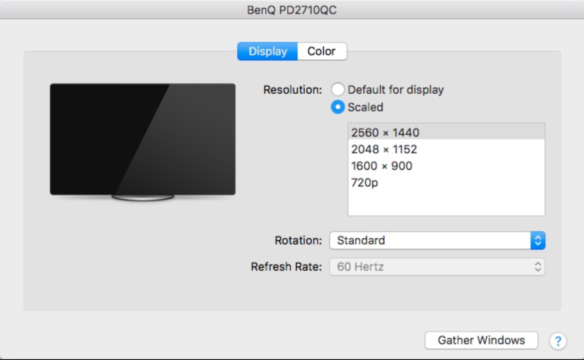

# HiDPI是什么？以及黑苹果如何开启HiDPI



黑苹果和白苹果最大的区别其实在显示效果上。同样一个网页，白苹果的显示就会细腻很多，而黑苹果颗粒感非常严重，造成上述原因是因为大多数苹果设备的屏幕本身的分辨率很高，如果你的显示器分辨率达到视网膜级别的话，哪怕是黑苹果也是默认开启 HiDPI 的。那么如何在普通的 1080P 或者 2k 显示器上实现 HiDPI的效果呢？本文是一个简短的 HiDPI 教程，希望可以帮助到大家。


### HiDPI 的概念

> HiDPI是什么鬼？萌新求科普…(水汪汪眼)

我不喜欢造无意义的轮子，大家参考这篇文章差不多就了解了:

[有关retina和HiDPI那点事](https://zhuanlan.zhihu.com/p/20684620)

总之 HiDPI 是苹果一个牛逼的显示技术，通过牺牲一定的分辨率实现更细腻的显示效果，这就是为什么 2K 显示器开启 HiDPI 的效果要比 1080P 好的原因了。


### 黑苹果命令下开启原生HiDPI

一条命令可开启接近原生的 HIDPI 设置，不需要 RDM 软件即可在系统显示器设置中设置，不过 RDM 有时候也是比较好用的，有些显示器不用开启，就可以在 RDM 里面选择一些带有 HiDPI 效果的分辨率。

**脚本的 Github 项目地址**: [GitHub - xzhih/one-key-hidpi: Enable macOS HiDPI](https://github.com/xzhih/one-key-hidpi)

终端下执行:

```
sh -c "$(curl -fsSL https://raw.githubusercontent.com/xzhih/one-key-hidpi/master/hidpi.sh)"
```

开启后重启生效！

> 如果你的设备不是黑苹果的话，那么请关闭 SIP 后再操作


### HiDPI 开关显示效果对比

> HiDPI开和不开的区别大吗？有对比图吗？无图无真相

实际观感体验区别还是很大的，下面放几张图片分别是`1080P`显示器下开启HiDPI 和不开的效果，当然 2K 屏幕或者 4K 屏幕开启效果会更细腻的:

###### 默认显示效果一



###### 开启HiDPI显示效果一




### HiDPI 开关其他区别

###### 开启 HiDPI 的系统设置界面



或者是这样的：




###### 未开启 HiDPI 的系统设置界面



可以看到 HiDPI 开启后 左侧的显示器里面会显示图片内容，当然这个也不一定准确。

Anyway，实际上观感变清晰了就可以了，不需要在意这些细节。