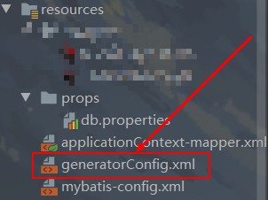
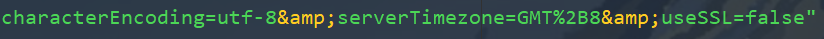

# MyBatis.Generator配上最新的MySQL8.0的注意事项

### 一、简介

mybatis-geneator是一款mybatis自动代码生成工具，可以通过配置，自动生成Entity、mapper和xml文件。


### 二、配置

**在pom文件的<build>下的<plugins>添加以下配置**

```java
			<plugin>
                <groupId>org.mybatis.generator</groupId>
                <artifactId>mybatis-generator-maven-plugin</artifactId>
                <version>1.4.0</version>
                <configuration>
                    <configurationFile>
                        <!--这里是配置generatorConfig.xml的路径
                         不写默认在resources目录下找generatorConfig.xml文件
                         -->
                    </configurationFile>
                    <verbose>true</verbose>
                    <overwrite>true</overwrite>
                </configuration>
                <dependencies>
                    <dependency>
                        <groupId>mysql</groupId>
                        <artifactId>mysql-connector-java</artifactId>
                        <version>8.0.20</version>
                    </dependency>
                </dependencies>
            </plugin>
```


 **再在resources下创建generatorConfig.xml**




**配置的信息如下：**

```
<?xml version="1.0" encoding="UTF-8"?>
<!DOCTYPE generatorConfiguration
        PUBLIC "-//mybatis.org//DTD MyBatis Generator Configuration 1.0//EN"
        "http://mybatis.org/dtd/mybatis-generator-config_1_0.dtd">

<generatorConfiguration>
    <!-- context 是逆向工程的主要配置信息 -->
    <!-- id：起个名字 -->
    <!-- targetRuntime：设置生成的文件适用于那个 mybatis 版本 -->
    <context id="default" targetRuntime="MyBatis3">

        <!--optional,旨在创建class时，对注释进行控制-->
        <commentGenerator>
            <property name="suppressDate" value="true"/>
            <!-- 是否去除自动生成的注释 true：是 ： false:否 -->
            <property name="suppressAllComments" value="true"/>
        </commentGenerator>

        <!--jdbc的数据库连接-->
        <jdbcConnection driverClass="com.mysql.cj.jdbc.Driver"
                        connectionURL="数据库地址?characterEncoding=utf-8&amp;serverTimezone=GMT%2B8&amp;useSSL=false"
                        userId="root"
                        password="root">
        </jdbcConnection>

        <!--非必须，类型处理器，在数据库类型和java类型之间的转换控制-->
        <javaTypeResolver>
            <!-- 默认false，把JDBC DECIMAL和NUMERIC类型解析为Integer-->
            <!-- 不是 double 和 long 类型 -->
            <!-- 使用常用的基本类型代替 sql 包下的引用类型 -->
            <property name="forceBigDecimals" value="false"/>
        </javaTypeResolver>

        <!-- targetPackage：生成的实体类所在的包 -->
        <!-- targetProject：生成的实体类所在的硬盘位置 -->
        <javaModelGenerator targetPackage="生成的实体类所在的包"
                            targetProject="生成的实体类所在的硬盘位置">
            <!-- 是否允许子包 -->
            <property name="enableSubPackages" value="false"/>
            <!-- 是否对modal添加构造函数 -->
            <property name="constructorBased" value="true"/>
            <!-- 是否清理从数据库中查询出的字符串左右两边的空白字符 -->
            <property name="trimStrings" value="true"/>
            <!-- 建立modal对象是否不可改变 即生成的modal对象不会有setter方法，只有构造方法 -->
            <property name="immutable" value="false"/>
        </javaModelGenerator>

        <!-- targetPackage 和 targetProject：生成的 mapper 文件的包和位置 -->
        <sqlMapGenerator targetPackage="生成的包"
                         targetProject="生成的所在的硬盘位置">
            <!-- 针对数据库的一个配置，是否把 schema 作为字包名 -->
            <property name="enableSubPackages" value="false"/>
        </sqlMapGenerator>

        <!-- targetPackage 和 targetProject：生成的 interface 文件的包和位置 -->
        <javaClientGenerator type="XMLMAPPER"
                             targetPackage="生成的包"
                             targetProject="生成的所在的硬盘位置">
            <!-- 针对 oracle 数据库的一个配置，是否把 schema 作为字包名 -->
            <property name="enableSubPackages" value="false"/>
        </javaClientGenerator>

        <table tableName="表名" domainObjectName="mapper文件头名字"
               enableCountByExample="false" enableUpdateByExample="false"
               enableDeleteByExample="false" enableSelectByExample="false"
               selectByExampleQueryId="false">
        </table>
    </context>
</generatorConfiguration>
```

（复制走改改就好！ ）


**注意！！！：**

```
因为用的是mysql-8.0.20

所以配置有所不同  

相信你们用8.0.20启动项目连接数据库的时候就遇到过了

主要就是新版本有新特性，
1）最新官方支持将com.mysql.jdbc.Driver改为com.mysql.cj.jdbc.Driver，
2）此外mysql8.0是不需要建立ssl连接的，你需要显示关闭，即url中的useSSL=false；
3）最后你需要设置CST，CST可视为美国、澳大利亚、古巴或中国的标准时间。serverTimezone是设置时区的。
```




这样一配置	就成功了！