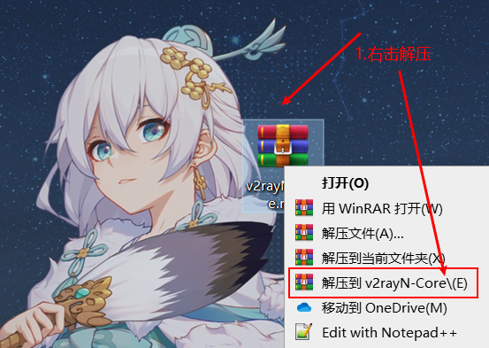
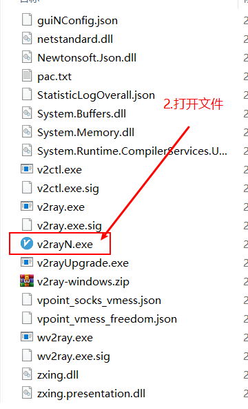
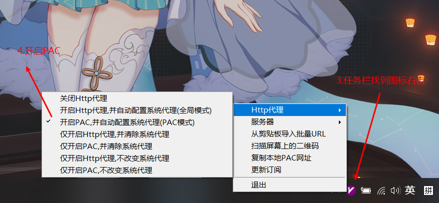
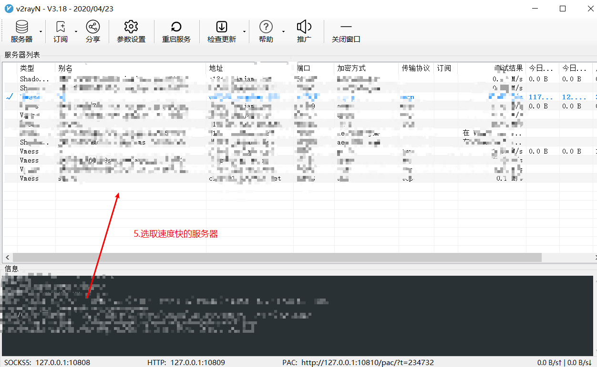
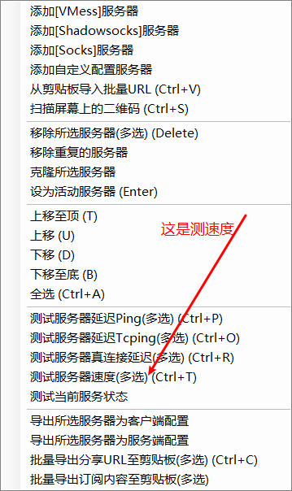
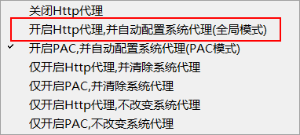
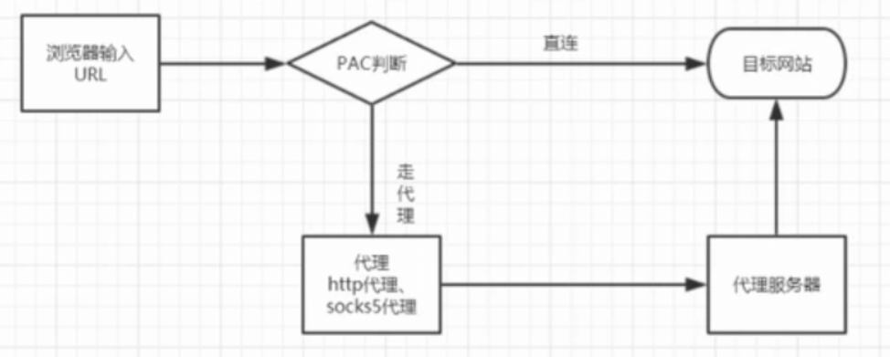
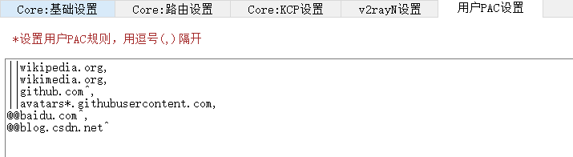

# V2rayN教学

针对connect world人士们的详细介绍，在此献上本文说明。

### 运行软件

首先接收我发给你的文件



then



then



then




如果不确定哪个服务器快，可以**右击你服务器出现以下界面**测速选择你心仪的对象~



### 扩展性功能

如果遇上上不了的网站或者很慢的网站，可以开启Http代理全局模式



之后请根据自己的规则来记录网站



这是PAC原理




简单的讲，PAC就是一种配置，它能让你的浏览器智能判断哪些网站走代理，哪些不需要走代理。

废话不多说，下面是v2rayN上面用户自定义的pac规则，因为gfwlist里面虽然网址多，但是总有一些不在列表里面的网站，所以就需要我们自己定义了，其实也很简单。

```
@@yukmingyu.xyz,
@@yukmingyuabc.xyz,
||abcdefg.com,
||defghij.com,
```

这样的意思是：

***yukmingyu.xyz 和 yukmingyuabc.xyz 是不走代理模式，***

***abcdefg.com 和 defghij.com 是走代理模式。***


更多PAC语法规则详情请移步Google，我只解析常用的。