# 在Windows下配置Redis集群

### 集群搭建

首先，要明确：节点数量（最少要 6 个，那就以 6 个节点为例）。

6个节点怎么分配？3 主 3 从（3 Master — 3 Slave），以端口号为例：

| 主（Master） | 从（Slave） |          备注           |
| :----------: | :---------: | :---------------------: |
|     7100     |    7101     | 末位0为主，其它数字为从 |
|     7200     |    7201     | 末位0为主，其它数字为从 |
|     7300     |    7301     | 末位0为主，其它数字为从 |

总体步骤：

1. 安装相应的程序（Redis 和 Ruby 都默认安装在 C 盘）
2. 新建 6 个配置文件夹和相关的配置文件（以 D 盘新建文件夹为例）
3. 进入命令行（运行 - cmd，最好开两个命令行窗口，方便复制）
4. 用 Redis 命令（redis-server）行安装 6 个 Redis 服务，并启动
5. 用 Ruby 命令（gem）安装 Redis 的相关组件（需要下载，看网速咯）
6. 用 [redis-trib.rb](https://raw.githubusercontent.com/MSOpenTech/redis/3.2/src/redis-trib.rb) 创建集群（注意 6 个 Redis 的顺序）
7. 创建 Redis 集群完毕

> **第一步** 安装下载的 Redis 和 RubyInstaller。

https://rubyinstaller.org/downloads/		----Ruby

https://github.com/microsoftarchive/redis/releases		----Windows桌面版Redis

*以下以默认安装路径为例。*

***在安装 Redis 的时候\***，*下面这个界面最好选上，方便随时执行 Redis 的相关命令。*

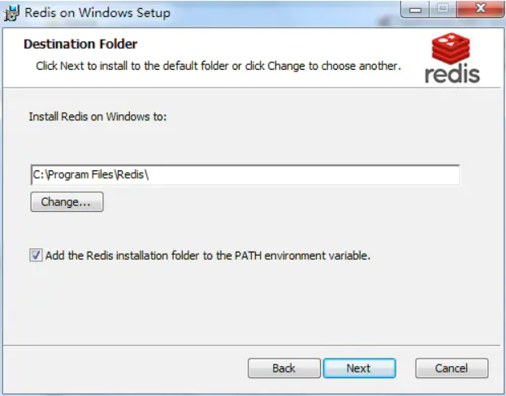

***在安装 RubyInstaller 的时候\***，*下面这个界面最好全选。可安装相应的支持环境，将 Ruby 的命令添加到系统的执行路径里面去（方便随时执行 gem），还有就是关联相应的 Ruby 后缀文件。*

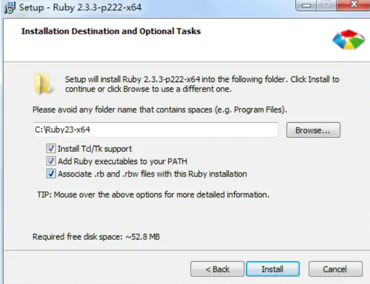

安装好后的路径如下：

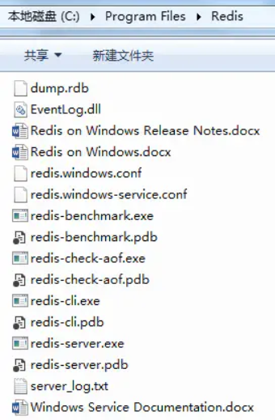

Redis 安装路径

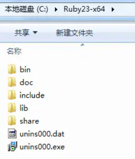

Ruby 安装路径

> **第二步** 新建 6 个 Redis 的文件夹和相应的配置文件（以端口命名文件夹）。

在 Redis 的安装目录，新建一个 cluster 的文件夹，里面新建 6 个子文件夹，以端口为名，如下图所示：

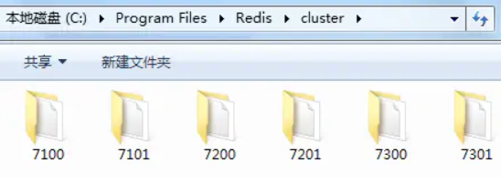

Redis 集群配置文件夹

*最好在 Redis 的安装目录内，新建集群的文件夹，以免碰到奇奇怪怪的问题。*

接下来，在每个文件夹内，新建一个后缀名为 conf 的配置文件：

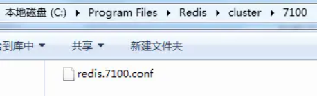

配置文件路径

```
# // 配置文件内容（以 redis.7100.conf 为例）

port 7100

appendonly yes
appendfilename "appendonly.7100.aof"

# // 如果要设置最大内存空间，可添加如下两句
maxmemory 200mb
maxmemory-policy allkeys-lru

cluster-enabled yes
cluster-config-file nodes-7100.conf
cluster-node-timeout 15000
cluster-slave-validity-factor 10
cluster-migration-barrier 1
cluster-require-full-coverage yes
```

新建完毕的目录结构，如下图所示：

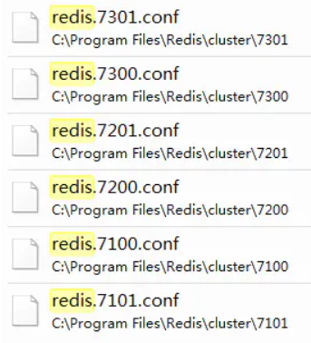


6 个配置文件的目录结构

*可将各配置文件中的相同配置项，提取到同一个文件中，形成全局配置，[详细方法看这里](https://yukmingyu.github.io/notes/#/dos/在Windows下配置多个Redis(简化配置).md)。*

> **第三步** 打开命令行（运行 - cmd 即可）。

*如果在配置完集群后，需要调整集群的话，建议打开两个命令行窗口，这样方便复制。*

> **第四步** 用 Redis 命令（redis-server）安装 6 个 Redis 服务，并启动

在命令行内，进入 C 盘的 Redis 安装目录。

安装第一个 Redis 服务，输入如下安装命令，然后回车（可能会弹出用户帐户控制，直接选 “是” 就行了）：

```
// 安装命令
redis-server --service-install cluster/7100/redis.7100.conf --service-name redis7100

// 卸载命令
redis-server --service-uninstall --service-name redis7100
```

看到下面这界面，第一个服务就安装成功了：

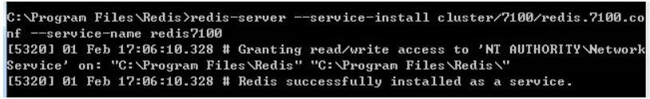

redis7100 安装成功

安装成功之后，打开系统的服务（运行 - services.msc），可以看到安装了 redis7100 这个服务：

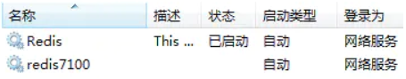

接下来，就启动该服务，输入如下启动命令（也可以直接在服务里面，右键，启动它）：

```
// 启动命令
redis-server --service-start --service-name redis7100

// 停止命令
redis-server --service-stop --service-name redis7100
```

至此，Redis7100 就安装成功并且启动了，如下图所示：

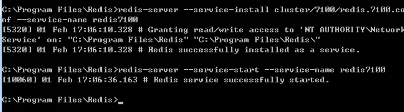

Redis7100 安装并启动成功

然后，对 7101、7200、7201、7300、7301 分别进行安装，并且启动它们。

全部完成后，在系统的服务里面，可以看到下图的内容：

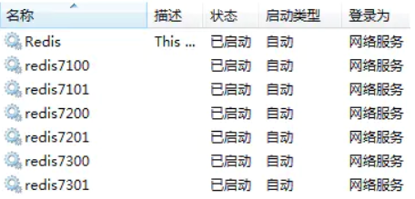

同时，在 Redis 的安装目录内，会出现多个文件，如下所示：

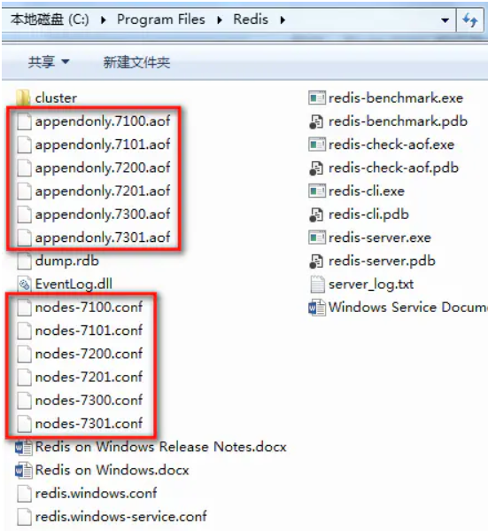

至此，6 个 Redis 服务已经全部安装并且启动完毕。

> **第五步** 用 Ruby 命令（gem）安装 Redis 的相关组件。

回到命令行窗口，输入以下命令：

```
gem install redis
```

执行完后，回车（此时，耐心等一下，要联网下载组件），直到看到以下内容：

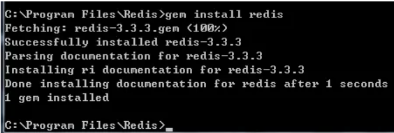

gem 安装结果

gem 安装指令成功，接下来，就是创建集群了。

> **第六步** 用 redis-trib.rb 创建集群。

redis-trib.rb 可以从 Windows 版的 Redis 处下载（[原文地址](https://github.com/MSOpenTech/redis/blob/3.2/src/redis-trib.rb)、[下载地址](https://raw.githubusercontent.com/MSOpenTech/redis/3.2/src/redis-trib.rb)）。

下载完后，将 rb 文件复制到 Redis 的安装目录内，然后回到命令行窗口，输入以下命令：

**注意：IP 地址的前 3 个为主（Master），后 3 个为从（Slave）。**当然，也可以在创建好之后手动重新调配。

默认的位置对应关系：

| 主（Master） | 从（Slave） |
| :----------: | :---------: |
|  第 1 个 IP  | 第 4 个 IP  |
|  第 2 个 IP  | 第 5 个 IP  |
|  第 3 个 IP  | 第 6 个 IP  |

```
redis-trib.rb create --replicas 1 127.0.0.1:7100 127.0.0.1:7200 127.0.0.1:7300 127.0.0.1:7101 127.0.0.1:7201 127.0.0.1:7301
```

输入后回车，会看到如下提示：

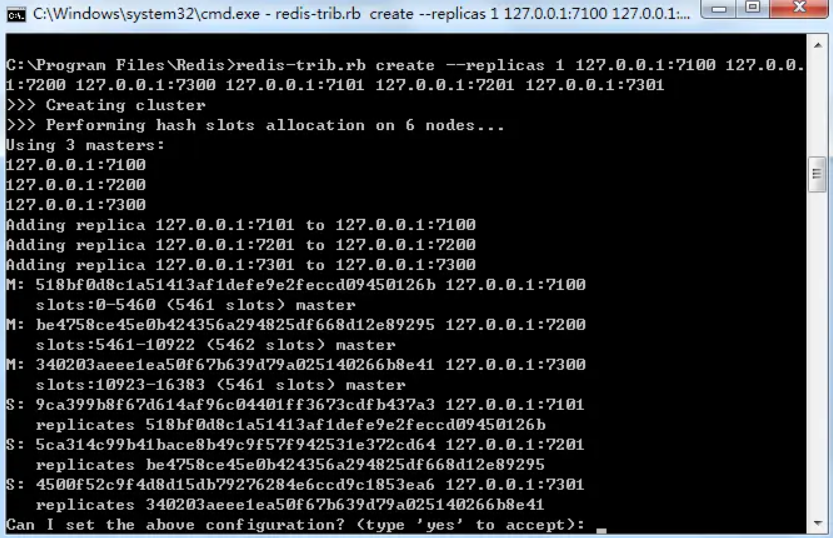

主（Master）- 从（Slave）对应关系

输入 yes 回车后，会自动配置好主从关系，如下图所示：

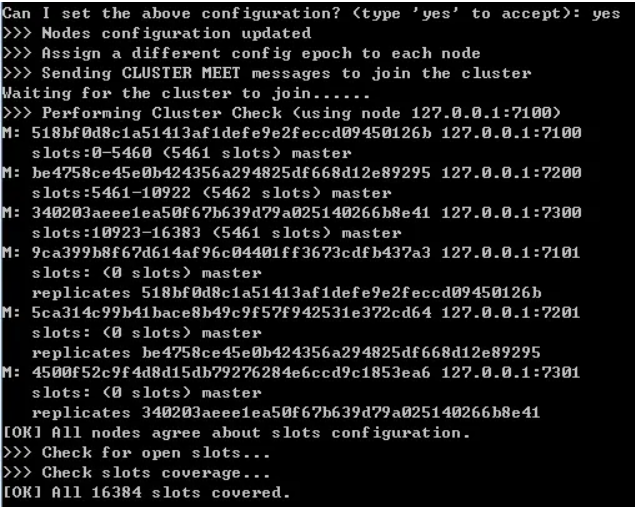

集群配置完毕

> **第七步** 至此，集群配置完毕。

**说明：** 在上图中，那些 40 位的编码，就是每个 Redis 节点的 ID，在调整集群时，经常会用到。

------

### 集群维护

打开命令行窗口，进入 Redis 安装目录，用客户端（redis-cli）即可查看集群情况，命令如下所示：

```
// 查看集群内所有的节点以及其关系
redis-cli -c -h 127.0.0.1 -p 7100 cluster nodes
```

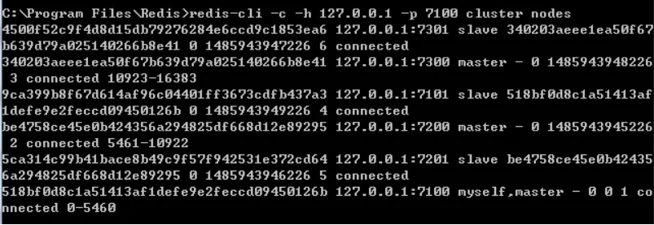

集群关系

也可以用客户端（redis-cli）登录到集群内任一节点，输入集群的命令，来查看集群的信息。


```swift
// 客户端登录集群命令（参数顺序无所谓，-h：ip地址 | -p：端口 | -c：集群标识）
redis-cli -c -p 7200 -h 127.0.0.1

// 客户端退出登录
quit
```

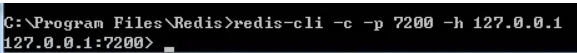

登录成功界面

登录之后，可以进行每个节点的操作，如果只查看集群的信息，输入 `cluster info`，则可以看到：

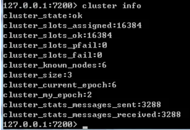

cluster info

集群特有的命令有（如果没有登录，那么，每次执行集群的命令时候，都要输入前面的登录指令）：

```
cluster info   // 集群总揽
cluster nodes   // 列出集群当前已知的所有节点（node），以及这些节点的相关信息

cluster meet <ip> <port>   // 将指定的节点（ip:port）添加到集群中，让它成为集群的一员
cluster forget <node_id>   // 从集群中移除 node_id 节点
cluster replicate <node_id>   // 将当前节点设置为 node_id 节点的从节点
cluster saveconfig   // 将节点的配置文件保存到硬盘里面

cluster addslots <slot> [slot ...]   // 将一个或多个槽（slot）指派（assign）给当前节点
cluster delslots <slot> [slot ...]   // 移除当前节点的一个或多个槽
cluster flushslots   // 移除当前节点的所有槽（删除集群内的最后一个主节点时，可用到）
cluster setslot <slot> node <node_id>   // 将槽 slot 指派给 node_id 节点。如果槽已经指派给另一个节点，那么先让另一个节点删除该槽，再进行指派
cluster setslot <slot> migrating <node_id>   // 将本节点的槽 slot 迁移到 node_id 节点中去
cluster setslot <slot> importing <node_id>   // 从 node_id 节点中导入槽 slot 到本节点来
cluster setslot <slot> stable   // 取消对槽 slot 的导入（import）或者迁移（migrate）

cluster keyslot <key> 计算键 key 应该被放置在哪个槽上
cluster countkeysinslot <slot> 返回槽 slot 目前包含的键值对数量
cluster getkeysinslot <slot> <count> 返回 count 个 slot 槽中的键
```

> 关于 `redis-trib.rb` 的一些使用

删除某个节点的命令如下：

```
redis-trib.rb del-node <ip>:<port> 'node_id'   // 单引号内放置节点id
```

**说明：**

- 如果是删除从（Slave）节点，上述命令即可。
- 如果是删除主（Master）节点，则要看情况：
- 如果主节点上有从节点，则要将从节点删除或转移到其它主节点上去，该主节点才能被删除。
- 如果主节点上有槽（Slot），则要将槽删除或转移到其它主节点上去，该主节点才能被删除。

转移槽的方法：

```
redis-trib.rb reshard <ip>:<port>   // 取消分配的槽（Slot）的节点

How many slots do you want to move (from 1 to 16384)? <number>   // 填入的数字应该是该节点的全部槽，从 reshard 命令列出来的条目中得到
What is the receiving node ID? <node_id>   // 需要接收这些槽的主节点 id，就是那 40 位编码
Please enter all the source node IDs.
  Type 'all' to use all the nodes as source nodes for the hash slots.
  Type 'done' once you entered all the source nodes IDs.
Source node #1: <node_id>   // 要删除的主节点的 id
Source node #2: done   // 输入 done

Do you want to proceed with the proposed reshard plan (yes/no)? yes   // 输入 yes
```

*待转移完后，再执行上面删除节点的命令。*

> - 如需配置 Redis（不含集群），[请看这里](https://yukmingyu.github.io/notes/#/dos/在Windows下配置Redis(不含集群).md)

