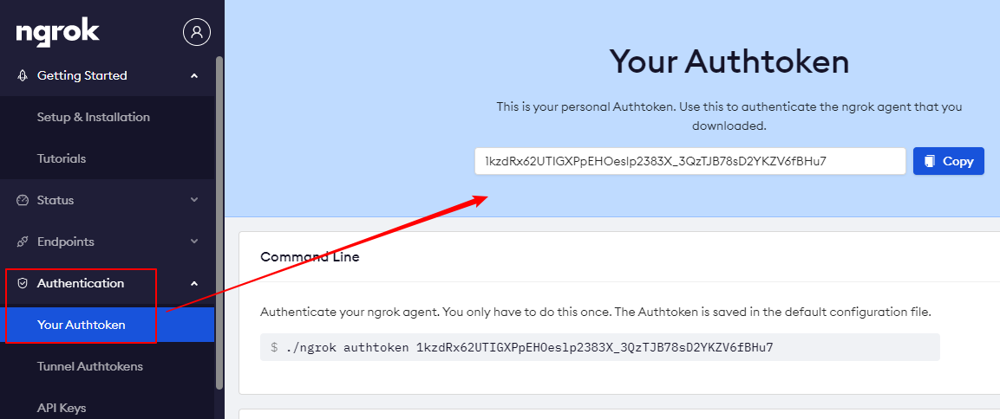
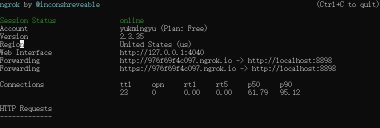

# 通用社交软件本地开发

### 1.注册ngrok账号,并下载客户端

https://ngrok.com/


### 2.查看Authentication




### 3.进入ngrok客户端目录	---->	cmd

输入命令,验证Authtoken:

```
ngrok authtoken 1kzdRx62UTIGXPpEHOeslp2383X_3QzTJB78sD2YKZV6fBHu7
```

运行:

```
ngrok http {服务的端口号}
```

成功:



输入	http://127.0.0.1:4040	网址可以查看地址.

